<div align="center">

# BipedalWalker-V3

### Deep Reinforcement Learning for Bipedal Locomotion on Hardcore Terrain

[](https://www.python.org/)
[](https://pytorch.org/)
[](https://gymnasium.farama.org/)
[](LICENSE)

**A systematic benchmark of SAC & TD3 algorithms combined with FeedForward, LSTM, and Transformer architectures for solving BipedalWalkerHardcore-v3 — one of the most challenging continuous control tasks in OpenAI Gymnasium.**

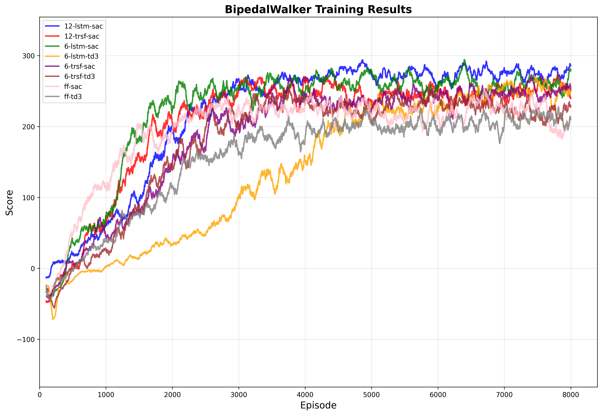

[Key Results](#-key-results) · [Demos](#-visual-demonstrations) · [Quick Start](#-quick-start) · [Architecture](#-neural-network-architectures) · [Reproduce](#-training) · [Docs](#-documentation)

</div>

---

## Why This Project?

BipedalWalkerHardcore-v3 is a **partially observable** continuous control problem featuring stairs, pitfalls, and stumps — demanding both robust low-level motor control and high-level terrain adaptation. Most open-source solutions only use basic MLP policies. This project goes further by:

- **Comparing 2 state-of-the-art algorithms** (SAC, TD3) across **5 neural network architectures** (FeedForward, MLP, LSTM, BiLSTM, Transformer)
- **Investigating temporal modeling**: Does feeding the agent a history of observations help? How many steps? Which encoder works best?
- **Providing 8 fully trained model configurations** with complete training logs, evaluation videos, and reproducible scripts

> **Best result: 303.6** (SAC + Transformer-12), surpassing the environment's "solved" threshold of 300.

---

## Key Results

### Performance Ranking

| Rank | Model | Algorithm | Architecture | Final Score | Peak Score |
|:----:|-------|:---------:|:------------:|:-----------:|:----------:|
| 1 | SAC_Transformer-12 | SAC | Transformer | **303.6** | 309.3 |
| 2 | TD3_LSTM-6 | TD3 | LSTM | **303.0** | 313.0 |
| 3 | SAC_LSTM-12 | SAC | LSTM | **302.4** | 314.6 |
| 4 | TD3_FeedForward | TD3 | FeedForward | 282.4 | 296.4 |
| 5 | TD3_Transformer-6 | TD3 | Transformer | 276.9 | 303.6 |
| 6 | SAC_FeedForward | SAC | FeedForward | 252.1 | 308.1 |
| 7 | SAC_LSTM-6 | SAC | LSTM | 213.9 | 322.2 |
| 8 | SAC_Transformer-6 | SAC | Transformer | 73.7 | 303.4 |

### Key Findings

| Insight | Detail |
|---------|--------|
| **TD3 is more stable** | Avg 287.5 ± 13.7 vs SAC's 229.2 ± 94.7 |
| **Temporal models shine** | Top 3 models all use sequence encoders (LSTM / Transformer) |
| **History length matters** | 12-step history consistently outperforms 6-step for SAC |
| **Fastest convergence** | TD3_LSTM-6 reached 300+ in only ~708 episodes |

<details>
<summary><b>View comparison charts</b></summary>

| SAC vs TD3 | SAC Architectures | TD3 Architectures |
|:---:|:---:|:---:|
| 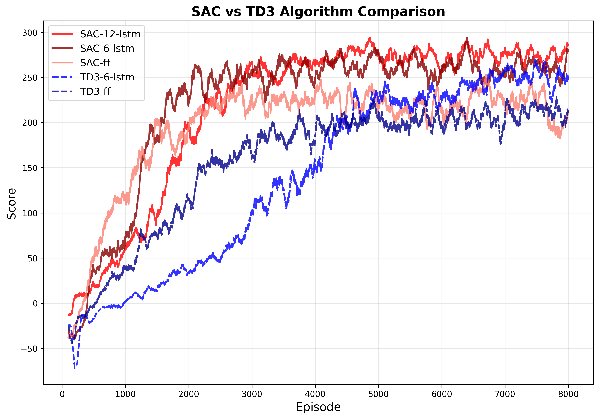 | 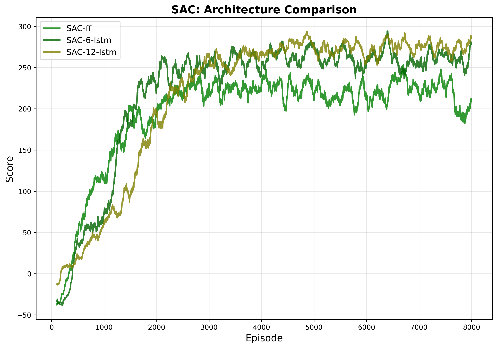 | 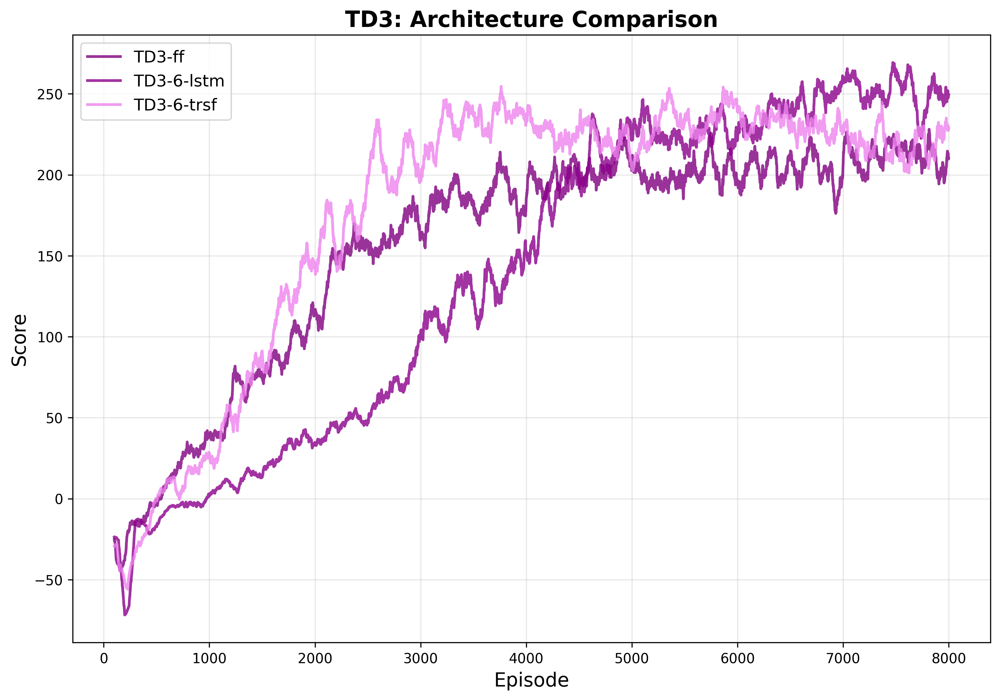 |

</details>

---

## Visual Demonstrations

### Agent Behavior Across Terrain Types

Each architecture handles obstacles differently. The images below compare **FeedForward**, **LSTM-12**, and **Transformer-12** (all SAC) on three hardcore terrain challenges:

<table>
<tr>
<th></th>
<th align="center">FeedForward</th>
<th align="center">LSTM-12</th>
<th align="center">Transformer-12</th>
</tr>
<tr>
<td><b>Hurdles</b></td>
<td>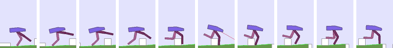</td>
<td>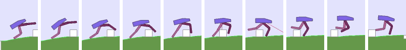</td>
<td>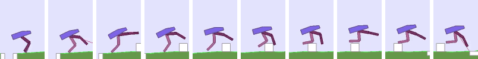</td>
</tr>
<tr>
<td><b>Pitfalls</b></td>
<td>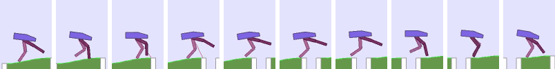</td>
<td>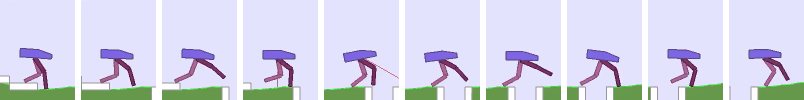</td>
<td>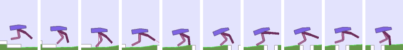</td>
</tr>
<tr>
<td><b>Stairs</b></td>
<td>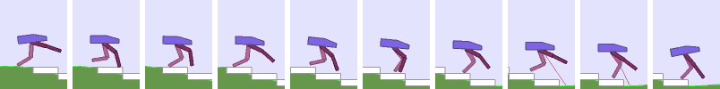</td>
<td>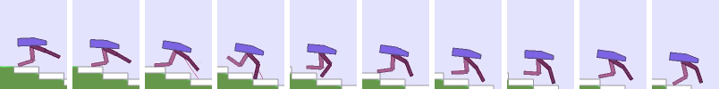</td>
<td>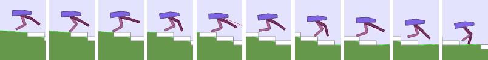</td>
</tr>
</table>

> Temporal models (LSTM, Transformer) show smoother gait and better obstacle anticipation — the agent "remembers" what terrain lies ahead using past observations.

### Walking Demos (GIF)

<table>
<tr>
<th colspan="4" align="center">SAC Algorithm</th>
</tr>
<tr>
<td align="center"><b>FeedForward</b></td>
<td align="center"><b>LSTM-6</b></td>
<td align="center"><b>LSTM-12</b></td>
<td align="center"><b>Transformer-12</b></td>
</tr>
<tr>
<td>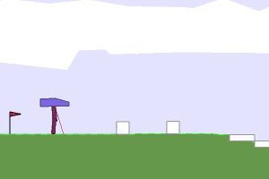</td>
<td>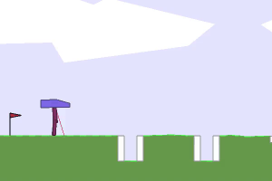</td>
<td>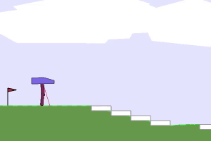</td>
<td>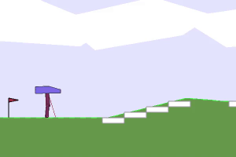</td>
</tr>
<tr>
<th colspan="4" align="center">TD3 Algorithm</th>
</tr>
<tr>
<td align="center"><b>FeedForward</b></td>
<td align="center"><b>LSTM-6</b></td>
<td align="center"><b>Transformer-6</b></td>
<td></td>
</tr>
<tr>
<td>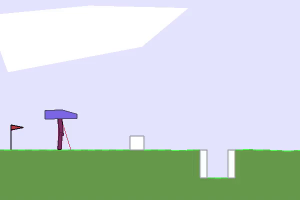</td>
<td>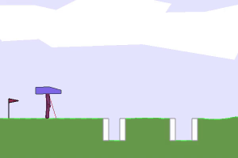</td>
<td>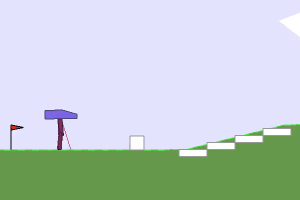</td>
<td></td>
</tr>
</table>

### Environment Overview

<table>
<tr>
<td align="center"><b>BipedalWalker-v3 (Classic)</b></td>
<td align="center"><b>BipedalWalkerHardcore-v3</b></td>
<td align="center"><b>Agent Anatomy</b></td>
</tr>
<tr>
<td></td>
<td>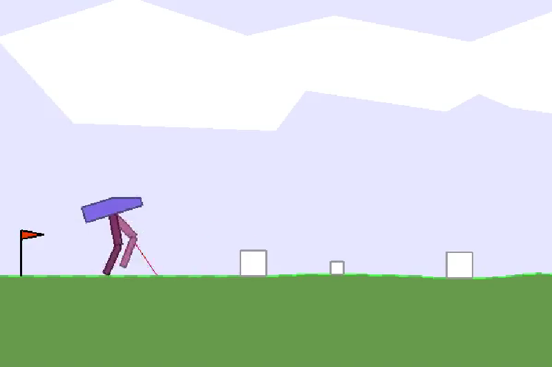</td>
<td>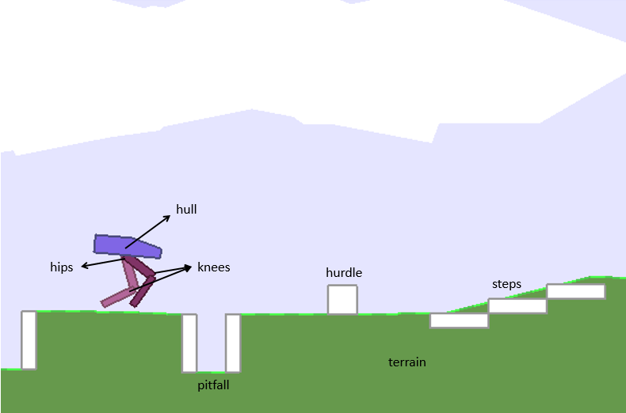</td>
</tr>
</table>

### Training Curves (Per Model)

<details>
<summary><b>Click to expand individual training curves</b></summary>

<table>
<tr>
<td align="center"><b>SAC + FeedForward</b></td>
<td align="center"><b>SAC + LSTM-6</b></td>
<td align="center"><b>SAC + LSTM-12</b></td>
</tr>
<tr>
<td>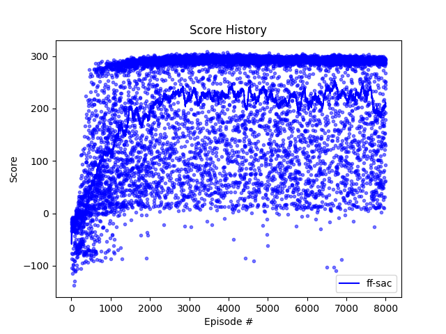</td>
<td>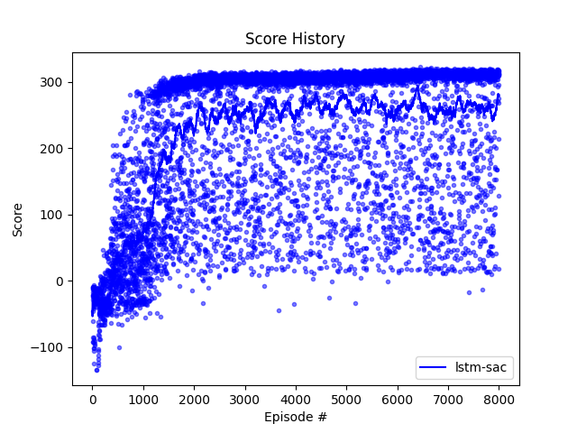</td>
<td>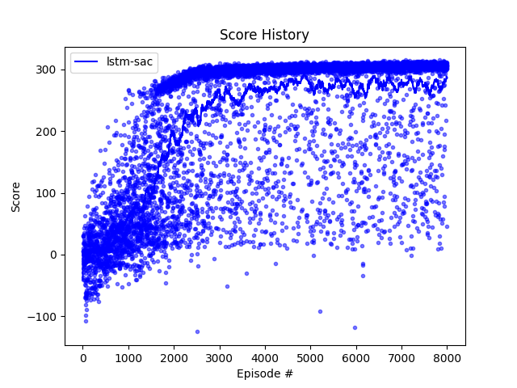</td>
</tr>
<tr>
<td align="center"><b>SAC + Transformer-6</b></td>
<td align="center"><b>SAC + Transformer-12</b></td>
<td align="center"><b>TD3 + FeedForward</b></td>
</tr>
<tr>
<td>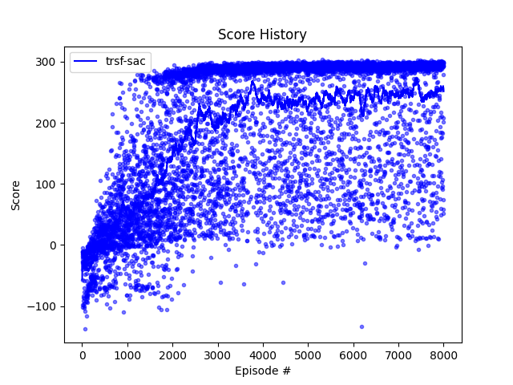</td>
<td>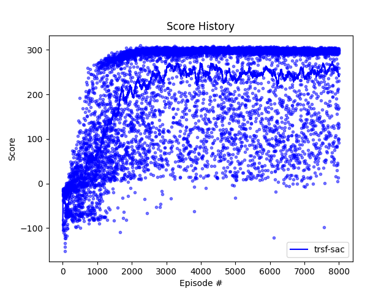</td>
<td>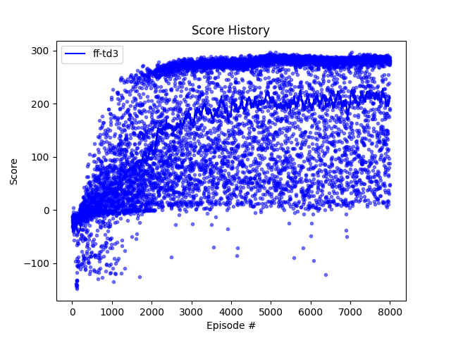</td>
</tr>
<tr>
<td align="center"><b>TD3 + LSTM-6</b></td>
<td align="center"><b>TD3 + Transformer-6</b></td>
<td></td>
</tr>
<tr>
<td>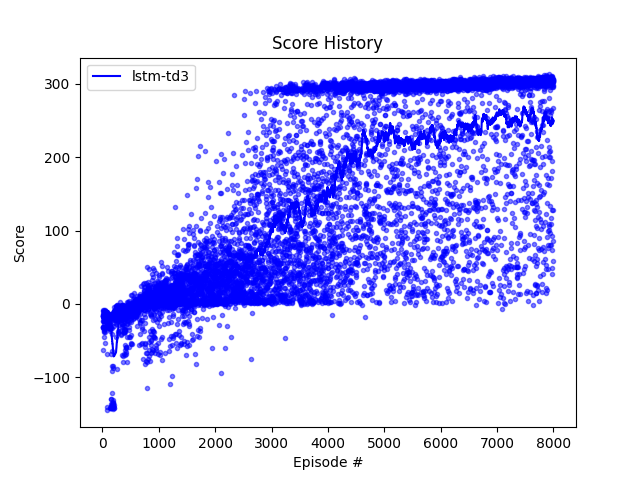</td>
<td>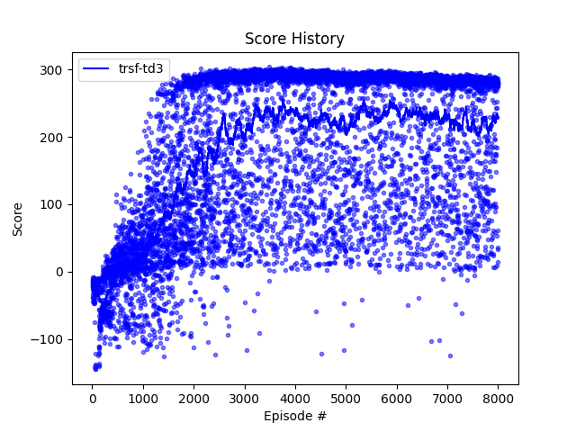</td>
<td></td>
</tr>
</table>

</details>

### Cumulative Score & Stability Analysis

<table>
<tr>
<td align="center"><b>SAC — Cumulative Scores</b></td>
<td align="center"><b>TD3 — Cumulative Scores</b></td>
</tr>
<tr>
<td>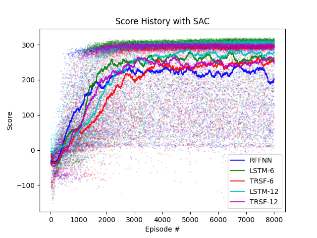</td>
<td>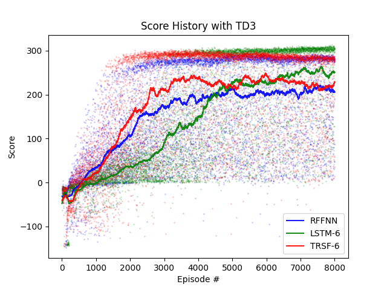</td>
</tr>
<tr>
<td align="center"><b>SAC — Score Std Dev</b></td>
<td align="center"><b>TD3 — Score Std Dev</b></td>
</tr>
<tr>
<td>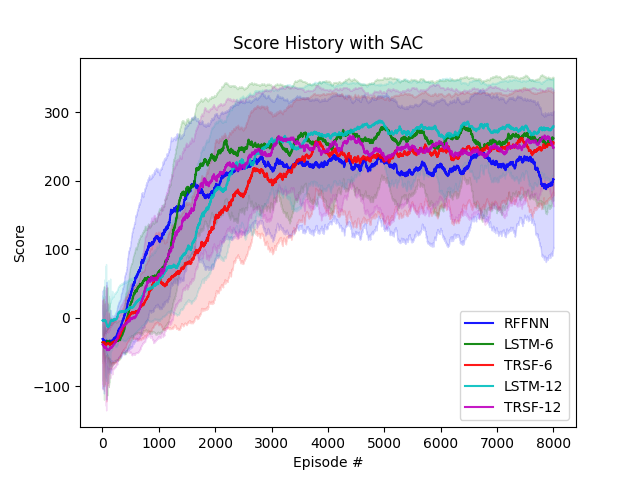</td>
<td>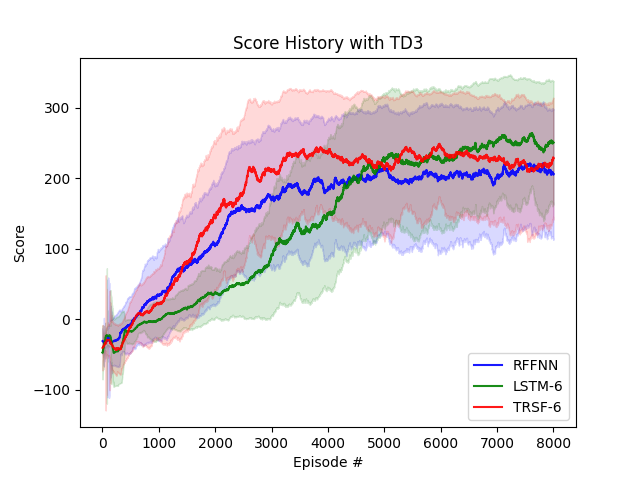</td>
</tr>
</table>

---

## Neural Network Architectures

This project implements a **plug-and-play architecture system** — each encoder can be combined with any RL algorithm:

```
Observation → [Encoder] → Latent → Actor (→ Action)
                                  → Critic (→ Q-value)
```

| Architecture | Encoder | Temporal | Key Design Choice |
|:------------:|---------|:--------:|-------------------|
| **FeedForward** | Linear + Residual Block + LayerNorm + GELU | No | Residual connection for gradient flow |
| **MLP** | Linear + LayerNorm + GELU (no residual) | No | Baseline without skip connections |
| **LSTM** | Single-layer LSTM (hidden=96) | Yes | Bias init trick: `bias_hh = -0.2` for recency |
| **BiLSTM** | Bidirectional LSTM (hidden=64×2) | Yes | Forward + backward temporal context |
| **Transformer** | Pre-Norm Transformer + Sinusoidal PE | Yes | `only_last_state` attention for efficiency |

**Custom Transformer design highlights:**
- Pre-Norm (LayerNorm before attention) for stable training — following [Xiong et al., 2020](https://arxiv.org/abs/2002.04745)
- Custom Multi-Head Attention with orthogonal weight init and identity output projection
- Flipped sinusoidal positional encoding (`log(1000)` base) for recent-step emphasis

---

## Quick Start

### Installation

```bash
git clone https://github.com/LinHao-city/BipedalWalker-V3.git
cd BipedalWalker-V3
pip install -r requirements.txt
```

<details>
<summary><b>Core dependencies</b></summary>

| Category | Packages |
|----------|----------|
| RL Framework | `gymnasium==0.28.1`, `Box2D`, `torch>=2.0` |
| Visualization | `matplotlib`, `seaborn`, `Pillow` |
| Data Analysis | `pandas`, `scipy` |
| Video | `imageio`, `imageio-ffmpeg`, `FFmpeg` |

</details>

### Evaluate a Pretrained Model

```bash
# Test SAC + FeedForward
python main_script.py -f test -r sac -m ff

# Test TD3 + LSTM (6-step history)
python main_script.py -f test -r td3 -m lstm -hl 6

# Test with video recording
python main_script.py -f test-record -r sac -m lstm -hl 12
```

### Generate Visualizations

```bash
# Training curves for all 8 models
python scripts/visualization/simple_plot.py

# Algorithm comparison charts
python scripts/visualization/plot_results.py

# Performance summary tables (CSV + Markdown)
python scripts/visualization/generate_tables.py

# Record demo videos for all models (H264 MP4, VSCode compatible)
python scripts/visualization/record_original_wrappers_fixed.py
```

---

## Training

Train any algorithm × architecture combination with a single command:

```bash
# SAC + FeedForward
python main_script.py -f train -r sac -m ff

# SAC + LSTM (12-step history)
python main_script.py -f train -r sac -m lstm -hl 12

# TD3 + Transformer (6-step history)
python main_script.py -f train -r td3 -m trsf -hl 6

# SAC + BiLSTM (12-step history)
python main_script.py -f train -r sac -m bilstm -hl 12
```

**Full parameter reference:**

| Flag | Options | Default | Description |
|------|---------|---------|-------------|
| `-r` | `sac`, `td3`, `ddpg` | `sac` | RL algorithm |
| `-m` | `ff`, `mlp`, `lstm`, `bilstm`, `trsf` | `ff` | Network architecture |
| `-hl` | `6`, `12` | `12` | History length (for sequential models) |
| `-e` | `classic`, `hardcore` | `hardcore` | Environment difficulty |
| `-l` | float | `4e-4` | Learning rate |
| `-b` | int | `64` | Batch size |
| `-g` | float | `0.98` | Discount factor γ |
| `-a` | float | `0.01` | SAC entropy coefficient α |

Models are saved every 200 episodes to `models/{algorithm}/{env_type}/`.

---

## Pretrained Models

The best checkpoint for each of the 8 model configurations is included in this repository, so you can **directly run evaluation and video recording without training from scratch**.

| Model | Algorithm | Checkpoint | Path |
|-------|:---------:|:----------:|------|
| SAC_FeedForward | SAC | ep7600 | `models/sac/hardcore/ep7600_ff_*` |
| SAC_LSTM-6 | SAC | ep7600 | `models/sac/hardcore-6/ep7600_lstm_*` |
| SAC_LSTM-12 | SAC | ep7200 | `models/sac/hardcore-12/ep7200_lstm_*` |
| SAC_Transformer-6 | SAC | ep6800 | `models/sac/hardcore-6/ep6800_trsf_*` |
| SAC_Transformer-12 | SAC | ep6000 | `models/sac/hardcore-12/ep6000_trsf_*` |
| TD3_FeedForward | TD3 | ep6600 | `models/td3/hardcore/ep6600_ff_*` |
| TD3_LSTM-6 | TD3 | ep7000 | `models/td3/hardcore-6/ep7000_lstm_*` |
| TD3_Transformer-6 | TD3 | ep6400 | `models/td3/hardcore-6/ep6400_trsf_*` |

Each model includes 3 files: `actor.pth` + `critic_1.pth` + `critic_2.pth` (24 files total, ~5.5 MB).

> **Note:** Only the best-performing checkpoint per configuration is included. Intermediate checkpoints (960 files, ~227 MB) are excluded via `.gitignore` to keep the repository lightweight. To regenerate all checkpoints, run the full training pipeline (~8000 episodes per model, see [Training](#-training)).

### Reproducing Results

| Task | Command | Requires Training? |
|------|---------|:------------------:|
| Evaluate a model | `python main_script.py -f test -r sac -m lstm -hl 12` | No |
| Record demo videos | `python scripts/visualization/record_original_wrappers_fixed.py` | No |
| Generate training plots | `python scripts/visualization/simple_plot.py` | No (uses logs) |
| Generate performance tables | `python scripts/visualization/generate_tables.py` | No (uses logs) |
| Train from scratch | `python main_script.py -f train -r sac -m lstm -hl 12` | Yes (~4h per model on GPU) |

All training logs (`results/logs/`) are included, so visualization scripts work out of the box.

---

## Project Structure

```
BipedalWalker-V3/
│
├── main_script.py                 # Main entry point (train / test / record)
├── requirements.txt               # Dependencies
│
├── src/                           # Core library
│   ├── agents/                    # RL agents
│   │   ├── sac_agent.py           #   Soft Actor-Critic (dual critics + entropy)
│   │   ├── td3_agent.py           #   Twin Delayed DDPG (delayed update + target noise)
│   │   └── ddpg_agent.py          #   Deep Deterministic PG (baseline)
│   ├── architectures/             # Neural network encoders
│   │   ├── feedforward.py         #   Residual FeedForward
│   │   ├── mlp.py                 #   Standard MLP
│   │   ├── lstm.py                #   Unidirectional LSTM
│   │   ├── bilstm.py              #   Bidirectional LSTM
│   │   └── transformer.py         #   Pre-Norm Transformer
│   ├── utils/                     # Utilities
│   │   ├── env_wrappers.py        #   Frame-skip + history observation wrappers
│   │   ├── noise.py               #   OU / Gaussian / Decaying noise generators
│   │   └── replay_buffer.py       #   Experience replay buffer
│   ├── training.py                # Training loop (8000 episodes, auto-stop at 300+)
│   └── evaluation.py              # Evaluation and plotting
│
├── archs/utils/                   # Low-level Transformer components
│   ├── mha.py                     #   Custom Multi-Head Attention
│   └── transformer.py             #   Positional Encoding + Transformer Layer
│
├── configs/                       # YAML configuration files
│   ├── env_config.yaml
│   ├── sac_config.yaml
│   └── td3_config.yaml
│
├── scripts/                       # Utility scripts
│   ├── train.py                   #   Enhanced training wrapper
│   └── visualization/             #   Plot, table, and video generation
│
├── models/                        # Pretrained checkpoints (.pth, git-ignored)
├── results/                       # Raw training logs and plots
├── evaluation_results/            # Generated evaluation outputs
│   ├── plots/                     #   Comparison charts
│   ├── tables/                    #   CSV + Markdown performance tables
│   ├── reports/                   #   Analysis reports
│   └── videos/                    #   H264 MP4 demo videos
│
└── docs/                          # Technical documentation
    ├── algorithm_comparison.md    #   SAC vs TD3 vs DDPG analysis
    └── architecture_design.md    #   Network architecture details
```

---

## Algorithm Details

### SAC (Soft Actor-Critic)

Maximum entropy RL — optimizes expected return **plus** policy entropy:

$$J(\pi) = \sum_t \mathbb{E}\left[\gamma^t r(s_t, a_t) + \alpha \gamma^t \mathcal{H}(\pi(\cdot|s_t))\right]$$

- **Stochastic policy** via tanh-Gaussian distribution
- **Dual critic** networks with min-Q target
- **Automatic entropy tuning** (α = 0.01)

### TD3 (Twin Delayed DDPG)

Three key improvements over DDPG:

1. **Clipped Double-Q**: `Q_target = min(Q₁, Q₂)` to reduce overestimation
2. **Delayed Policy Update**: Actor updates every 2 critic updates
3. **Target Policy Smoothing**: Add clipped Gaussian noise to target actions

### Exploration Strategies

| Algorithm | Exploration Noise |
|:---------:|-------------------|
| SAC | Entropy-based (no explicit noise) |
| TD3 | Decaying Ornstein-Uhlenbeck (θ=4.0, σ=1.2, decay=0.9995) |
| DDPG | Ornstein-Uhlenbeck (θ=3.0, σ=0.9) |

### Shared Hyperparameters

| Parameter | Value |
|-----------|-------|
| Learning rate | 4×10⁻⁴ |
| Discount factor (γ) | 0.98 |
| Soft update (τ) | 0.01 |
| Batch size | 64 |
| Replay buffer | 500K |
| Optimizer | AdamW (amsgrad=True) |
| Max episodes | 8,000 |
| Frame skip | 2 |

---

## Environment Wrappers

Two custom Gymnasium wrappers are applied:

| Wrapper | Purpose |
|---------|---------|
| `MyWalkerWrapper` | Frame-skip (2×), death penalty (−10), Gymnasium API compatibility |
| `BoxToHistoryBox` | Stacks last *h* observations into shape `(h, 24)` for sequence models |

---

## Documentation

| Document | Description |
|----------|-------------|
| [`docs/algorithm_comparison.md`](docs/algorithm_comparison.md) | Detailed SAC vs TD3 vs DDPG analysis with math |
| [`docs/architecture_design.md`](docs/architecture_design.md) | All 5 architecture designs with formulas |
| [`evaluation_results/reports/`](evaluation_results/reports/) | Model performance evaluation report |
| [`evaluation_results/tables/`](evaluation_results/tables/) | Performance ranking tables (CSV + Markdown) |

---

## Troubleshooting

| Issue | Solution |
|-------|----------|
| `FFmpeg not found` | `conda install -c conda-forge ffmpeg -y` |
| `gymnasium` import error | `pip uninstall gym && pip install gymnasium Box2D` |
| Video won't play in VSCode | Ensure H264 codec + yuv420p pixel format |
| CUDA out of memory | Add `-d cpu` to use CPU |

---

## Citation

If you use this codebase in your research, please consider citing:

```bibtex
@misc{bipedalwalker-v3,
  title   = {BipedalWalker-V3: Deep RL Benchmark with Temporal Architectures},
  year    = {2025},
  url     = {https://github.com/LinHao-city/BipedalWalker-V3}
}
```

## References

- [Haarnoja et al., 2018 — Soft Actor-Critic](https://arxiv.org/abs/1812.05905)
- [Fujimoto et al., 2018 — TD3](https://arxiv.org/abs/1802.09477)
- [Lillicrap et al., 2015 — DDPG](https://arxiv.org/abs/1509.02971)
- [Vaswani et al., 2017 — Attention Is All You Need](https://arxiv.org/abs/1706.03762)
- [Xiong et al., 2020 — On Layer Normalization in Transformer](https://arxiv.org/abs/2002.04745)

---

## License

This project is licensed under the [MIT License](LICENSE).
