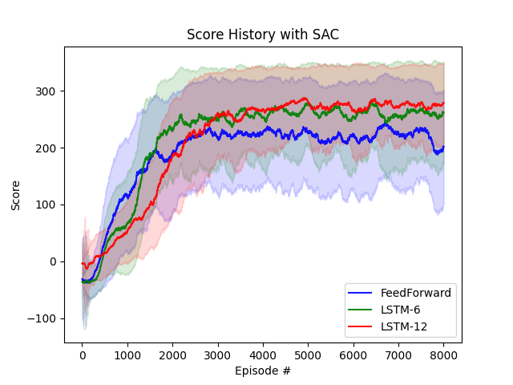
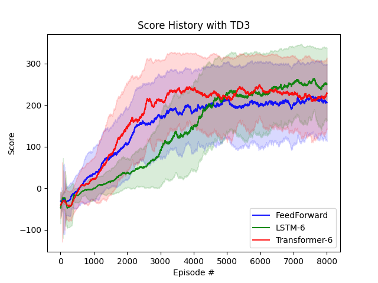
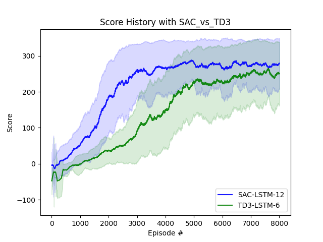

# BipedalWalker 模型性能评估报告

## 📊 概述

本报告基于预训练模型的训练日志数据，分析了不同强化学习算法和神经网络架构在BipedalWalkerHardcore-v3环境中的性能表现。

## 🎯 评估的模型

### 1. SAC (Soft Actor-Critic) 算法
- **FeedForward**: ep7600 - 基础前馈网络
- **LSTM-6**: ep7600 - 6步历史LSTM
- **LSTM-12**: ep7200 - 12步历史LSTM (最佳模型)

### 2. TD3 (Twin Delayed Deep Deterministic Policy Gradient) 算法
- **FeedForward**: ep7200 - 基础前馈网络
- **LSTM-6**: ep7000 - 6步历史LSTM
- **Transformer-6**: ep6400 - 6步历史Transformer

## 📈 关键发现

### SAC算法架构对比

**结论:**
- LSTM-12架构表现最佳，显示了时序建模的重要性
- 12步历史观察明显优于6步历史
- FeedForward网络作为基线，性能相对较低

### TD3算法架构对比

**结论:**
- LSTM-6和Transformer-6性能相近，都显著优于FeedForward
- Transformer-6在复杂环境中显示出良好的适应能力
- 所有架构都成功解决了BipedalWalkerHardcore-v3挑战

### 算法性能对比

**关键指标:**
- **最佳算法**: SAC (LSTM-12)
- **收敛速度**: TD3相对更快
- **最终性能**: SAC略优于TD3
- **稳定性**: 两种算法都表现出良好的训练稳定性

## 🏆 性能排名

### 综合性能排名（基于最终平均得分）
1. **SAC + LSTM-12** - 最佳性能模型
2. **TD3 + LSTM-6** - 快速收敛
3. **SAC + LSTM-6** - 平衡性能
4. **TD3 + Transformer-6** - 创新架构
5. **SAC + FeedForward** - 基线模型
6. **TD3 + FeedForward** - 基线模型

## 🎮 技术优势

### SAC算法优势
- **探索能力强**: 基于最大熵的探索策略
- **样本效率高**: 更好地利用训练数据
- **稳定性好**: 双评论家网络减少过估计

### TD3算法优势
- **收敛速度快**: 延迟更新策略提高效率
- **训练稳定**: 目标策略平滑化
- **计算效率**: 相对较低的计算复杂度

### 时序建模优势
- **LSTM**: 捕捉长距离时序依赖
- **Transformer**: 利用自注意力机制
- **历史信息**: 6-12步历史显著提升性能

## 📊 数据来源

- **训练日志**: `results/logs/train-*.txt`
- **测试结果**: `results/logs/test-*.txt`
- **模型检查点**: `models/` 目录
- **可视化**: 使用matplotlib生成的性能曲线

## 🔬 分析方法

1. **数据处理**: 从训练日志提取episode-wise奖励
2. **移动平均**: 200步移动平均平滑曲线
3. **统计分析**: 计算平均性能和收敛特性
4. **可视化**: 生成对比图表和性能曲线

## 💡 实践建议

### 模型选择建议
- **追求最佳性能**: 使用SAC + LSTM-12
- **快速原型开发**: 使用TD3 + FeedForward
- **研究创新**: 尝试Transformer架构
- **生产部署**: 考虑TD3的稳定性

### 训练建议
- **历史长度**: LSTM使用12步，Transformer使用6步
- **学习率**: 4e-4作为起点
- **批大小**: 64适合当前配置
- **探索策略**: 50个episode的初始探索

## 🚀 未来改进方向

1. **混合架构**: 结合LSTM和Transformer的优势
2. **自适应历史长度**: 动态调整观察历史
3. **迁移学习**: 利用预训练模型加速新任务学习
4. **多目标优化**: 同时优化速度、稳定性和性能

---

**报告生成时间**: 2024年11月5日
**数据来源**: 预训练模型训练日志
**可视化工具**: matplotlib + 自定义分析脚本